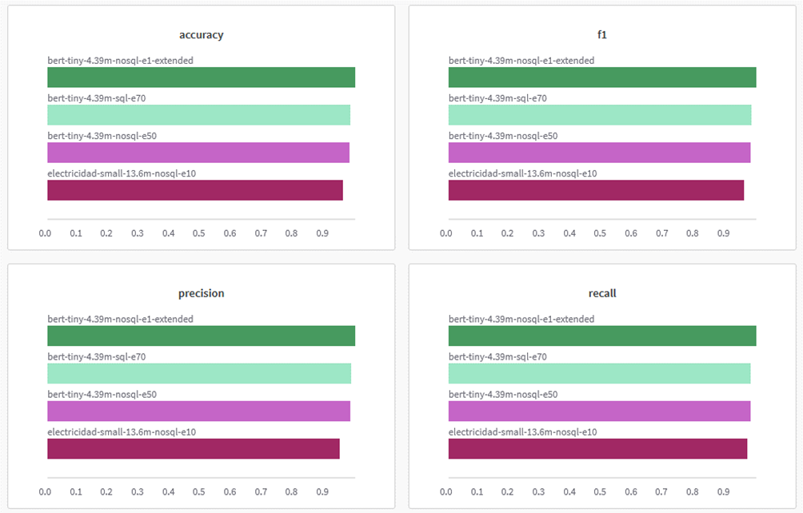
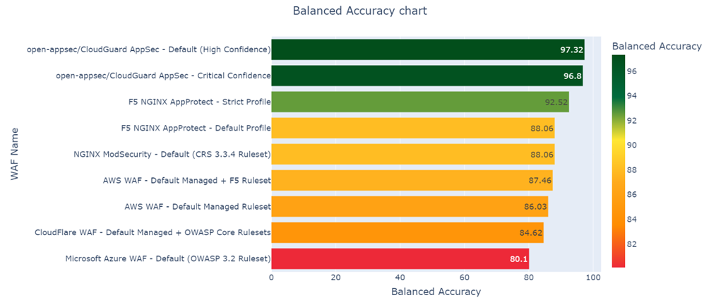
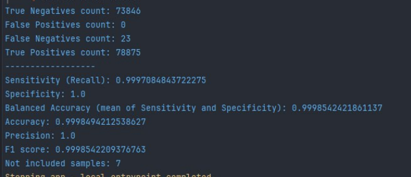
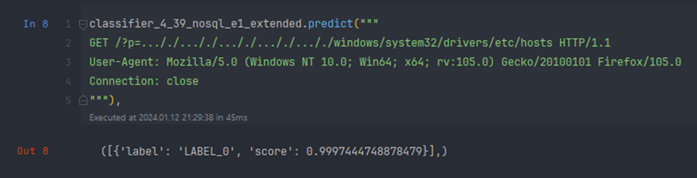
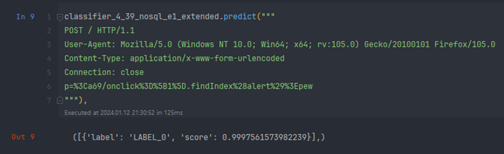
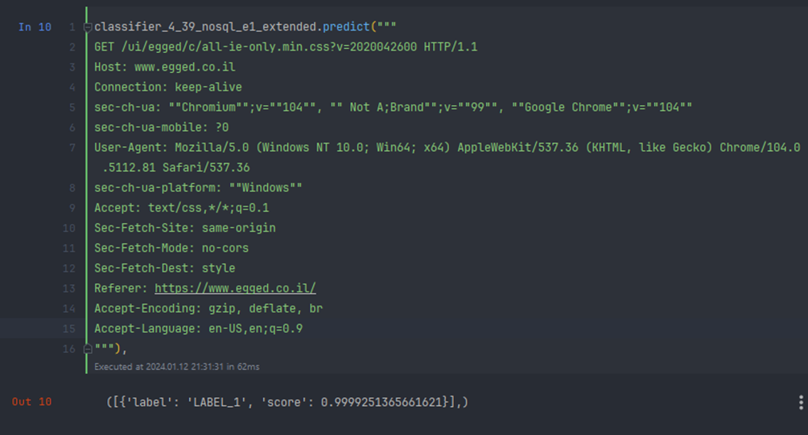
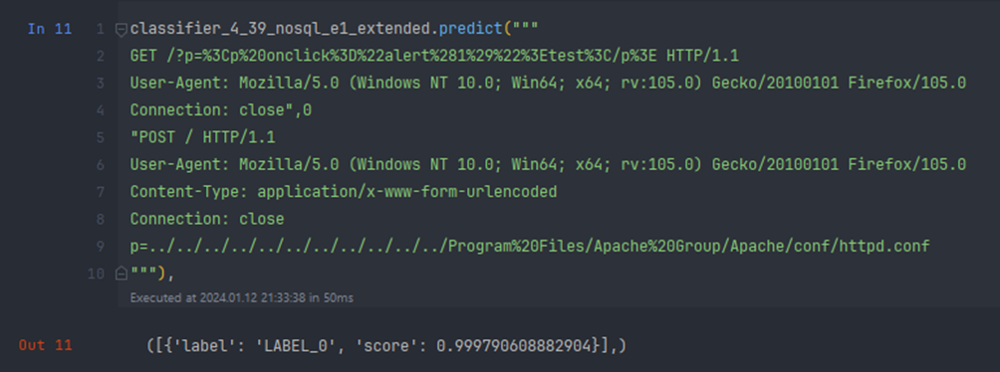
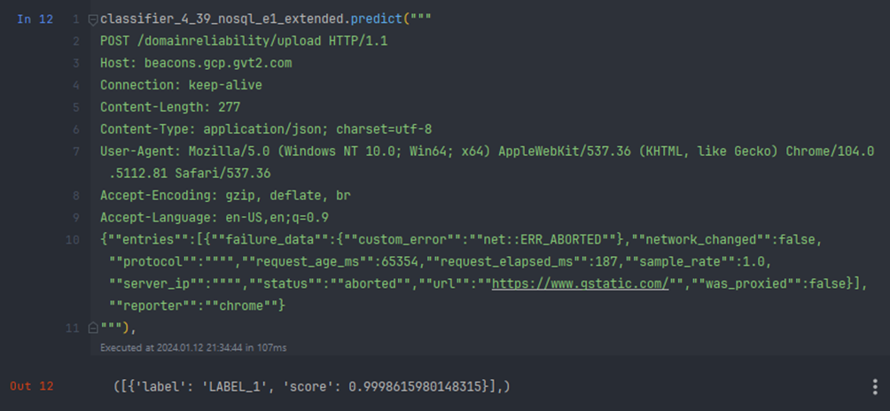
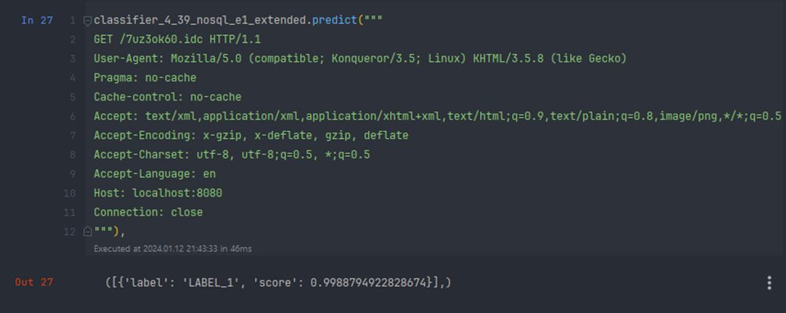

# About

The study addresses the security issues of modern web applications, potential attacks through the HTTP protocol, 
and the shortcomings of existing Web Application Firewalls (WAFs) and their ability to either allow or mistakenly 
trigger traffic. 

To address these shortcomings, a method of building an HTTP traffic classifier based on 
Natural Language Processing (NLP) with transformer architecture was explored. The hypothesis was tested, and the 
results indicated that such a classifier could better handle the task of detecting anomalous activity. 
This was demonstrated through testing with nine different popular WAF solutions.

For this project BERT model was used:
- mrm8488/bert-tiny-finetuned-sms-spam-detection - 4.39M params

# Model limitations
I processed HTTP traffic with maximum lengths of 700 characters or 400 tokens for the BERT model. 
However, there is room for improvement. The speed of the model was not measured because optimization is required 
before conducting any comparisons with other production-ready Web Application Firewalls (WAFs).

# Model accuracy 

The accuracy of the model was evaluated in two ways:
- using validation data;
- using data provided from 
[openappsec](https://www.openappsec.io/post/best-waf-solutions-in-2023-real-world-comparison);

On the validation data the model performs with:
- Accuracy: 0.9988;
- Precision: 0.9987;
- Recall: 0.9989;
- F1-score: 0.9988;

The model performs better than 9 WAFs from 
[this comparison](https://www.openappsec.io/post/best-waf-solutions-in-2023-real-world-comparison). 

The balanced accuracy of the best Web Application Firewall (WAF) with ruleset, as per the comparison, is 0.9732. 
In contrast, my model demonstrates a balanced accuracy of 0.9998, calculated as the mean of Sensitivity and Specificity.

# Examples

The label 'LABEL_0' indicates an anomaly, while 'LABEL_1' signifies a benign HTTP request.

